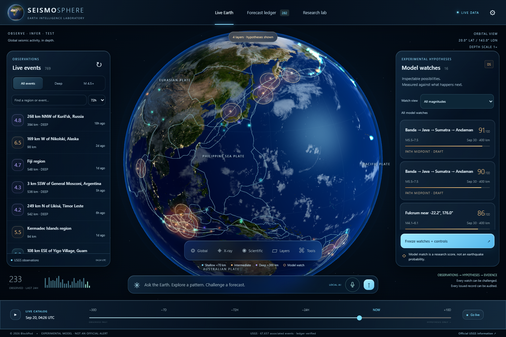
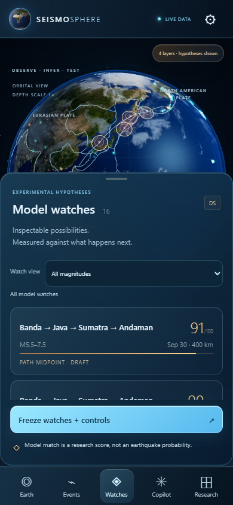

# SeismoSphere AI

### Observe the Earth. Explore the evidence. Test the hypothesis.

**A local-first, interactive 3D seismic research workspace by BlockPod.** SeismoSphere brings earthquake observations, geological reference layers, configurable forecasting hypotheses and AI-assisted analysis into a cinematic liquid-glass interface.

[Explore the features](#features-at-a-glance) · [Get started](#getting-started) · [Build status](docs/BUILD-STATUS.md) · [License](LICENSE)

## The workspace

**Live Earth, in context.** Rotate the globe, inspect earthquake depths, follow configured paths and move through time. Observation markers and experimental watch regions stay visually distinct, with source information available for inspection.

## Features at a glance

| Capability | What you can do |
| --- | --- |
| **Interactive 3D Earth** | Explore detailed Earth imagery, atmosphere, plate boundaries and cinematic or scientific rendering. |
| **Live catalog and replay** | Filter earthquake observations by region, magnitude and depth; inspect historical catalog states. |
| **Geological inspection** | Examine slab surfaces, mapped faults, cratons, terrain and true-depth hemisphere or radial cutaways. |
| **Configurable route engine** | Edit directed waypoints and connections, record provenance, preview paths and retain immutable route revisions. |
| **Auditable model watches** | Inspect supporting and contradictory evidence; freeze hypotheses and compare retained outcomes with controls. |
| **Local-first AI** | Use local Ollama models or the configured ChatGPT-authenticated Astra integration; common view commands execute without AI calls. |
| **Research and export** | Work with statistical experiments, station recordings and source-linked figure, video and evidence exports. |
| **Responsive access** | Use dedicated mobile navigation and touch-friendly watch panels; launch the Windows workspace from its desktop icon. |

### Built for the smaller screen

A focused watch sheet keeps the globe in view while providing magnitude filters, evidence selection and explicit forecast-freezing controls. The mobile layout has been checked in desktop browser emulation; physical-device acceptance remains in progress.

*Screenshots show the running application with catalog data at capture time. Earth textures and lighting are illustrative composites, not live satellite imagery. Imagery: [Solar System Scope](https://www.solarsystemscope.com/textures/) ([CC BY 4.0](https://creativecommons.org/licenses/by/4.0/)), with texture layers from the Three.js examples; plate reference: PB2002 / fraxen; earthquake observations: USGS. See [sources and credits](#sources-and-credits).*

> **Research status:** Actively developed experimental software. Model-match scores are not calibrated earthquake probabilities, and configured pressure-transfer routes remain illustrative unless documented as source-traced. This is not an official warning system. See the [implementation status and remaining work](docs/BUILD-STATUS.md).

## Getting started

Double-click **Launch SeismoSphere.cmd**, or run `node server/index.mjs` with Node.js 24+. Open http://127.0.0.1:4318. The launcher starts the backend in a hidden window and reuses an existing instance. Port 4317 was already occupied and is left untouched.

The **SeismoSphere AI** desktop icon opens a dedicated Edge/Chrome app window, starts the local backend and requests a catalog refresh. It also starts the installed Ollama service if needed. Run `Create-DesktopShortcut.ps1` to recreate this installation's icon. The main interface uses translucent liquid-glass panels, an 8K desktop Earth, atmospheric shading and responsive phone controls.

Run `node scripts/setup.mjs` to restore local Three.js and Earth/plate assets. The runtime has no npm dependencies. Run `npm test` for the scientific and persistence tests.

## Working capabilities

- Hemisphere and radial cutaways with selectable sides, true-depth corridor projection, scientific/cinematic presentation, both AI controls and matching figure/video evidence. See [cutaway controls and limits](docs/HEMISPHERE-CUTAWAY.md).

- IASP91/ak135 modeled arrivals, exact manual waveform picks, preserved interpretation history, source-linked reproduction and both AI providers. See [phase analysis and interpretation limits](docs/PHASE-ANALYSIS.md).

- Registered prospective experiments with frozen rules and schedules, automatic matched-control issuance, fixed outcome assessments, explicit exclusions, immutable exports and local/Astra explanations. See [prospective experiments](docs/PROSPECTIVE-EXPERIMENTS.md).

- Append-only forecast result reviews after catalog corrections, original/latest assessment comparison, exact reproduction and local/Astra explanations. See [result history and preserved evidence](docs/RESOLUTION-REVIEWS.md).

- Dated Smithsonian global weekly volcano reports, source receipts, globe selection, local/Astra explanations and historical isolation. See [weekly report provenance and freshness](docs/WEEKLY-VOLCANOES.md).

- Five primary Earth controls, native Layers/Tools panels, visible hypothesis status and a bounded inspection stack. See [the Earth workspace](docs/EARTH-WORKSPACE.md).
- Spatial catalog sonification with camera-relative audio, magnitude/depth/age mappings, volume and chronological plotted-event sequences. See [audio behavior and verification limits](docs/SONIFICATION.md).

- NOAA ETOPO terrain and seafloor displacement, source-sample inspection, true-scale depth views, optional elevation colors and local/Astra explanations. See [relief provenance and display limits](docs/RELIEF.md).
- A real WebGL globe with 8K desktop / 4K mobile Earth imagery, separate cloud shell, night lights, atmospheric rim, plate geometry, event selection, depth-aware X-ray, model volumes, hypothesis paths and field, camera presets and sonification.
- Optional scientific rendering with an unlit day composite, solid markers, manual camera steps, persistent view preference and matching publication evidence. See [scientific view and browser limits](docs/SCIENTIFIC-VIEW.md).
- Responsive mobile workspace with one bottom sheet at a time, 44-pixel primary touch controls, safe-area handling, reduced-motion camera support and an installable manifest.
- USGS monthly live feed with five-minute refresh, persistent observation revisions, provider provenance and cached operation when disconnected.
- Durable global and regional USGS/EMSC imports, including dateline rectangles, with pause/resume/cancel, restart recovery, adaptive chunks, retry and immutable receipts. Strict observation-history replay is distinct from revised-catalog event-time hindcasts. See [catalog imports](docs/CATALOG-IMPORTS.md).
- Configurable Dutchsinse-style research rules for deep triggers, geographic corridors, midpoints, silence contrasts, spacing, reflection and magnitude heuristics. Each score exposes its evidence and objections.
- Frozen prospective and hindcast records, exact input snapshots, SHA-256 chaining, SQLite update/delete guards, export, resolution and separate prospective statistics.
- Seeded uniform-area and empirical recent-activity controls with matched windows, magnitude envelopes and radii. Descriptive historical comparisons with future events withheld from generation.
- Resumable randomized-catalog experiments regenerate DS and matched controls for every synthetic catalog, preserve exact inputs and report conditional Monte Carlo comparisons. See [randomized controls and reproduction](docs/RANDOMIZED-CONTROLS.md).
- Local Ollama primary AI (Qwen 3.6 35B by default), signed-in Codex / Astra optional brain, and an explicit deterministic evidence renderer. AI outputs are validated against a fixed list of UI actions; issuing forecasts remains a user action.
- Local neural retrieval uses nomic embeddings of relative seismic sequence graphs with outcome-free encoding and cached vectors. Its similarity is not a probability or a trained seismic GNN result.
- A locally trained weekly cell-graph model with separate training/validation/test periods, an ablation without neighbors, count baselines, immutable weights and Earth maps. Install its isolated CPU runtime with `scripts/setup-model.ps1`. See [learned-model methods and results](docs/LEARNED-MODEL.md).
- Historical experiment reports and their forecast records are immutable and separate from prospective evaluation. Interactive two-event geodesic midpoint exploration is available from event details.
- Regional temporal ETAS fitting with a published likelihood, frozen-parameter holdout scoring, optimizer diagnostics, conditional rate plots and exportable input snapshots. See [the model notes](docs/STATISTICAL-MODEL.md).
- Regional Gaussian spatial ETAS with finite-region integrals, training-only KDE comparison, immutable inputs and historical 1/7/10-day Earth component maps. Local AI and Astra receive cutoff-limited context for the selected run. See [spatial model notes and limits](docs/SPATIAL-ETAS.md).
- Regional magnitude completeness diagnostics: MAXC, b-stability, temporal/cell distributions, native-scale filtering, conditional bootstrap uncertainty, immutable snapshots and responsive SVG/JSON exports. Local Qwen and Astra can explain a selected saved sample. See [catalog completeness](docs/CATALOG-COMPLETENESS.md).
- Provider alias association, explicit USGS deletion revisions, stale-response rejection and a selectable single-provider research catalog. Unidentified provider deletions are preserved for reconciliation.
- Published Slab2 regional surfaces: 27 source grids, depth/uncertainty colors, supplementary branch points, source inspection, both brains and matching exports. See [surface provenance and restoration](docs/SLAB-SURFACES.md).
- Published USGS Slab2 depth contours and a genuinely clipped/capped Earth wedge with true-depth earthquake sections. See [geological view provenance and limits](docs/GEOLOGICAL-VIEW.md).
- Oblique geological sections defined by centre/bearing or two picked/typed endpoints, adjustable corridors, depth profiles and JSON/CSV/editable SVG export. Dateline/polar routes and fixed-section observation selection are supported.
- Private-LAN HTTPS phone access with single-use pairing, controller/viewer permissions, device revocation, expiry display and reviewed trust replacement. See [phone access and lifecycle instructions](docs/PHONE-ACCESS.md); physical-device acceptance is still pending.
- Earth video clips: native MP4/WebM capture, landscape/portrait canvases, pause/resume, optional catalog sound, cutoff disclosure and matching evidence. See [recording behavior and browser limits](docs/RECORDING.md).
- Publication figures: capture the current Earth as a 2400×1800 PNG or an SVG with editable captions and embedded evidence. Download matching JSON with the displayed revisions, analysis, filters, camera, credits and checksum. See [figure export](docs/FIGURE-EXPORT.md).
- Source-labeled event annotations follow orbit, depth views and sections, avoid workspace controls and accompany figure/video evidence. Keyboard activation reopens the event inspector.
- Smooth orbital focus and a controllable flight along a selected watch's illustrative route, including manual steps for reduced-motion users. See [camera travel](docs/CAMERA-TRAVEL.md).
- GEM mapped active faults: 16,195 preserved source traces, searchable attributes, nearest surface-trace queries, globe highlighting, copilot reference context and attributed publication export. See [mapped-fault provenance and limits](docs/MAPPED-FAULTS.md).
- NGL GNSS velocities: immutable IGS20 and plate-fixed solutions, 3D station arrows, reported uncertainties, source inspection, local/Astra explanations and attributed exports. See [GNSS sources and historical rules](docs/GNSS.md).
- Refreshed USGS volcano activity: official ground alerts and aviation codes, immutable source/poll history, source inspection, historical isolation, both brains and mobile Earth markers. See [status coverage and verification](docs/VOLCANO-ACTIVITY.md).
- Sourced craton reference: 114 mapped Archean basement regions, reworking distinctions, searchable original attributes, spherical boundary proximity, section clipping, local/Astra explanations and attributed exports. See [craton sources and restoration](docs/CRATONS.md).
- EarthScope station metadata and archived raw waveforms: selectable 3D station markers, exact microsecond samples, preserved source segments, immutable receipts, SVG/GeoCSV/JSON export and local Qwen/Astra explanations. See [instrument sources and limits](docs/INSTRUMENTS.md).

## Important scientific boundaries

The route configuration is a documented **illustrative research graph**, not an authenticated transcription of Dutchsinse's map. The briefs supplied broad rules but no exact map, weights or validation dataset. No calibrated probability or established pressure-transfer physics is claimed. Heterogeneous magnitude types are preserved, and Mw-equivalent moment heuristics disclose that approximation.

The strongest 180 source events per lookback are used in the initial pair search. Plate distance is to sampled PB2002 vertices, not a precise nearest fault segment. Numerical source analogues compare depth and magnitude; neural retrieval embeds a relative sequence description with a pretrained local text model. Neither retrieval method is a trained seismic graph network. A separate locally trained weekly cell-graph model now has frozen training/validation/test splits, a no-neighbor ablation, count baselines, Earth maps and reproducible exports; see [the learned model](docs/LEARNED-MODEL.md). Uniform-area null and recent-rate controls are not ETAS.

Revised historical catalogs cannot reconstruct exactly what an operator knew decades ago. Strict mode uses `observed_at` recorded by this installation; dates before installation contain no strict observations. The AI is instructed to use only cutoff-limited supplied context, but an LLM's pretrained knowledge cannot be erased: use the deterministic renderer for strictly auditable historical explanations.

The hash chain detects local alteration relative to its retained head. It is not an external trusted timestamp, and a machine administrator can replace the database. Export the head and snapshots to independent storage for stronger audit guarantees.

## Still required by the full brief

Evaluation of Unreal / Cesium for the visual quality target; regional terrain detail beyond the implemented global ETOPO relief; continuous overturned-branch topology, uncertainty volumes and multi-segment curved sections beyond the working Slab2 regional grids, contours and oblique Earth sections; canonical craton-route integration beyond the implemented Hasterok reference and global volcanic report coverage beyond the implemented static Smithsonian reference and refreshed USGS U.S. status feed, phase analysis and broader network acceptance beyond the working archive/SeedLink waveform inspector, and fault surfaces beyond mapped traces; an authenticated canonical Dutchsinse route map; region/completeness validation beyond the working diagnostics and temporal/spatial ETAS experiments; stress models; event-graph/transformer discovery and analogue models beyond the working weekly cell-graph count model; prospective calibration and skill significance; cross-provider identity reconciliation; physical acceptance of secure phone access; physical XR acceptance and full in-headset research workflows; deployment/installer hardening and sustained device testing. These are not represented by fake active controls or fabricated results. See [the acceptance checklist](docs/BUILD-STATUS.md).

## Data and privacy

The owner workspace binds to loopback and rejects foreign hosts/origins. Optional sharing binds authenticated HTTPS to one selected private-LAN address. Its separate HTTP bootstrap serves only setup instructions and a public certificate. Pairing, certificate trust, firewall setup, permissions and remaining physical-device checks are described in [phone access](docs/PHONE-ACCESS.md). This is intended for a trusted personal desktop and private network, not an internet-hosted multi-user service.

SQLite data lives in `data/seismosphere.sqlite`; copy the database with the app stopped for a consistent backup, or export the ledger in the UI. Ollama requests go to `127.0.0.1:11434`. Selecting Astra sends analytical context and the question through the locally installed, ChatGPT-authenticated Codex CLI. It consumes the user's subscription allowance and is subject to account access. No API key is extracted or embedded.

## Sources and credits

- [USGS live GeoJSON](https://earthquake.usgs.gov/earthquakes/feed/v1.0/geojson.php) and [FDSN catalog](https://earthquake.usgs.gov/fdsnws/event/1/).
- [Peter Bird PB2002 / fraxen tectonic plates](https://github.com/fraxen/tectonicplates), ODC Attribution. Cite Bird, P. (2003), An updated digital model of plate boundaries, G3, 4(3), 1027, doi:10.1029/2001GC000252.
- [Three.js](https://threejs.org/), MIT. Earth imagery in its examples derives from [Solar System Scope](https://www.solarsystemscope.com/textures/), CC BY 4.0, with cloud/bump layers prepared by the Three.js contributors. Original 2K normal/specular maps are from the Three.js planet examples.
- [Ollama Chat API](https://docs.ollama.com/api/chat).
- [Codex SDK](https://learn.chatgpt.com/docs/codex-sdk) and [ChatGPT/Codex authentication](https://learn.chatgpt.com/docs/auth).
- [W3C WCAG 2.2](https://www.w3.org/TR/WCAG22/) informs keyboard, contrast, motion and touch decisions; no complete conformance certification is claimed.

Textures are illustrative Earth composites, not live satellite imagery. Lighting is cinematic. Model layers are experimental; for emergency decisions consult official agencies.

Hypocenters are retained beneath the surface. Orbital mode adds separately rendered epicentral projections; X-ray reveals the hypocenters. Depth exaggeration is always labeled. At extreme exaggeration, depths that would pass the Earth's center are clamped to 4% of the displayed radius and the HUD reports `CORE CLAMP`.

D-SPF currently visualizes the sum of spherical Gaussian kernels centered on up to 16 candidates, weighted by model match / 100. The angular kernel is `exp(-(1-cos(theta))/0.004)` and visual intensity is clipped to 0–1. It has no physical pressure unit and is not a probability field.

Spatial Earth is available under **Tools → Spatial Earth**, with native WebXR VR/AR entry, live scene rendering, ray-selected observations, source notes and restoration. Hardware acceptance remains open. See [Spatial Earth](docs/SPATIAL-EARTH.md).

Inside Spatial Earth, **Ask** opens a custom question about the selected observation or leading visible draft. A controller keyboard and touch/physical-keyboard input support editing; answers use the same saved evidence through local Qwen or Astra.

The microphone beside the copilot input provides local dictation with editable transcripts. English uses the installed local Whisper model; other available languages use Windows offline speech. Review and insert the text, then send it to the selected local or Astra brain. See [Voice input](docs/VOICE-INPUT.md).

The spatial view now offers local/Astra explanations for selected earthquakes and draft watches, plus counterarguments and paged answers. It retains the original analysis cutoff and withholds responses after relevant context changes.
`Spatial Earth → Ask` also supports offline Dictate / Transcribe, installed-language selection and editable text before sending to local AI or Astra. See [spatial voice details](docs/SPATIAL-EARTH.md#immersive-dictation) for controls and physical-device verification limits.
Stations also provides [saved waveform frequency analysis](docs/SPECTRA.md): continuous-window selection, detrending, spectral tapers, source-linked CSV/JSON/SVG and local/Astra explanations.

Continuous station acquisition is available under **Stations**. Install its local decoder with `scripts/setup-instruments.ps1`, load current metadata, then Start, Stop and Capture an exact channel. Captures retain original SeedLink packets and work with the existing spectrum and AI tools. See [station acquisition and verification](docs/INSTRUMENTS.md#continuous-acquisition).

Saved recordings also support full StationXML response correction to displacement, velocity or acceleration, with explicit frequency/taper settings, physical-unit spectra/time-frequency maps and original-source exports. See [response correction](docs/RESPONSE-CORRECTION.md).

Route editing is available in **Tools → Route network**. Enter ordered waypoints or pick them on Earth, choose direction and explicit outgoing connections, record source provenance, then save a named revision. Saved forecasts never change when the network changes. See [Route network](docs/ROUTE-NETWORK.md).

Immediate copilot controls include “Show only targets above M6”, “Trace paths from Fiji”, “Find unresolved fulcrums”, “Show all watches”, “Remove plate labels”, “Use scientific view” and “Use cinematic view”. These exact view commands run locally without consuming AI usage; analytical questions still use your selected brain.

## Copyright and license

**Copyright © 2026 BlockPod. All rights reserved.**

SeismoSphere AI's original copyrightable project material is proprietary and is not offered under an open-source license. Use, modification or redistribution beyond applicable law or platform-granted rights requires written permission from BlockPod. See [LICENSE](LICENSE).

Third-party software, imagery and scientific datasets retain their respective copyrights, licenses and attribution requirements. BlockPod's notice does not claim ownership of those materials, underlying facts or third-party methodologies. See [NOTICE.md](NOTICE.md) and [sources and credits](#sources-and-credits).
